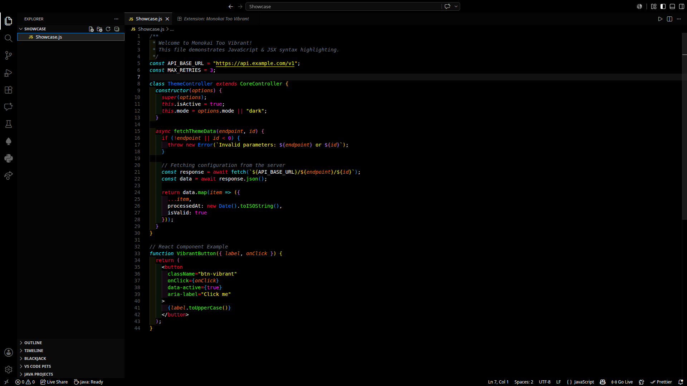
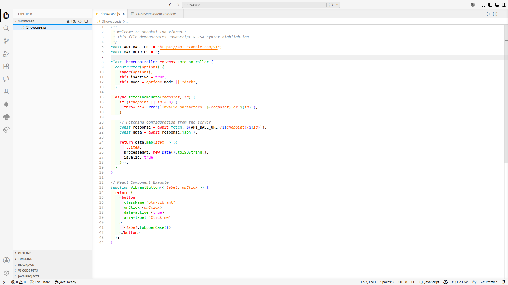

# Monokai Too Vibrant 🎨

A bold, ultra-high contrast take on the classic Monokai theme for Visual Studio Code. 

Designed for developers who love extreme contrast, this extension pushes color saturation to the limit. Whether you prefer coding in the dark or the light, these themes feature pure black (`#000000`) or pure white (`#FFFFFF`) backgrounds with syntax highlighting that truly pops off the screen.

## 🌟 The Variants

This extension includes 4 distinct themes to suit your contrast preferences:

### Dark Themes
*   **Monokai Dark Too Vibrant:** The ultimate high-contrast dark theme. Features a pure black background with raw, extremely saturated primary and secondary hex colors. 
*   **Monokai Dark Very Vibrant:** Keeps the pure black background but slightly softens the syntax colors for a richer, more nuanced, yet still intensely vivid experience.

### Light Themes
*   **Monokai Light Too Vibrant:** A pure white background paired with maximally saturated colors, carefully adjusted to remain visible and piercingly clear on a light canvas.
*   **Monokai Light Very Vibrant:** A more balanced light theme. Retains the pure white background but uses deeper, richer vibrant colors for better harmony and eye comfort.

## 📸 Screenshots


*Monokai Dark Too Vibrant*


*Monokai Light Very Vibrant*

## 🙌 Acknowledgements

This extension is a heavily modified, high-contrast fork based on the excellent [Monokai Vibrant](https://github.com/dylantmarsh/monokai-vibrant) theme created by [Dylan Marsh](https://github.com/dylantmarsh).

## 🚀 Installation

1. Open **Extensions** sidebar panel in Visual Studio Code. `View → Extensions`
2. Search for `Monokai Too Vibrant`
3. Click **Install**
4. Click **Reload** (if required)
5. Go to `Settings > Theme > Color Theme` and select your favorite variant!

Alternatively, install via the command line:
```bash
code --install-extension TMaume.monokai-too-vibrant

```

## 🐛 Issues & Contributions

Found a bug, missing syntax highlighting, or have a suggestion? Feel free to open an issue or submit a pull request on the [GitHub Repository](https://github.com/TMaume/Monokai-Too-Vibrant).

## 📝 License

This theme is released under the [MIT License](https://opensource.org/licenses/MIT).
